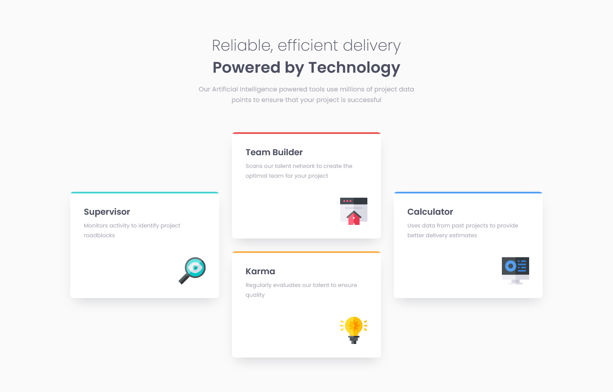

# Frontend Mentor - Four card feature section solution

This is a solution to the [Four card feature section challenge on Frontend Mentor](https://www.frontendmentor.io/challenges/four-card-feature-section-weK1eFYK). Frontend Mentor challenges help you improve your coding skills by building realistic projects. 

## Table of contents

- [Overview](#overview)
  - [The challenge](#the-challenge)
  - [Screenshot](#screenshot)
  - [Links](#links)
- [My process](#my-process)
  - [Built with](#built-with)
  - [What I learned](#what-i-learned)
  - [Continued development](#continued-development)
  - [Useful resources](#useful-resources)
- [Author](#author)
- [Acknowledgments](#acknowledgments)

## Overview

### The challenge

Users should be able to:

- View the optimal layout for the site depending on their device's screen size

### Screenshot

### Links

- [Solution URL](https://github.com/loki-pepe/four-card-feature-section)
- [Live Site URL](https://loki-pepe.github.io/four-card-feature-section/)

## My process

### Built with

- Semantic HTML5 markup
- CSS custom properties
- Flexbox
- CSS Grid
- Mobile-first workflow

### What I learned

I acquired a better understanding of Flexbox and I got introduced to the basics of CSS Grid. Also, I transitioned to using `rem` units for sizing text and defining @media queries, but I still used pixels for paddings and margins as I don't see the need for resizing them alongside the font size, as they would unnecessarily take up more screen real estate as the root font gets larger.

### Continued development

I plan on deepening my knowledge of CSS Grid via building more complex layouts.

### Useful resources

- [Learn web development by web.dev](https://web.dev/learn) - Great courses for web development basics.
- [MDN Web Docs](https://developer.mozilla.org/) - An extensive resource on everything HTML and CSS.
- [Flexbox Zombies](https://mastery.games/flexboxzombies/) - A great game to get better acquainted with Flexbox.

## Author

- GitHub - [Lovro Peraić](https://github.com/loki-pepe)
- Frontend Mentor - [@loki-pepe](https://www.frontendmentor.io/profile/loki-pepe)
